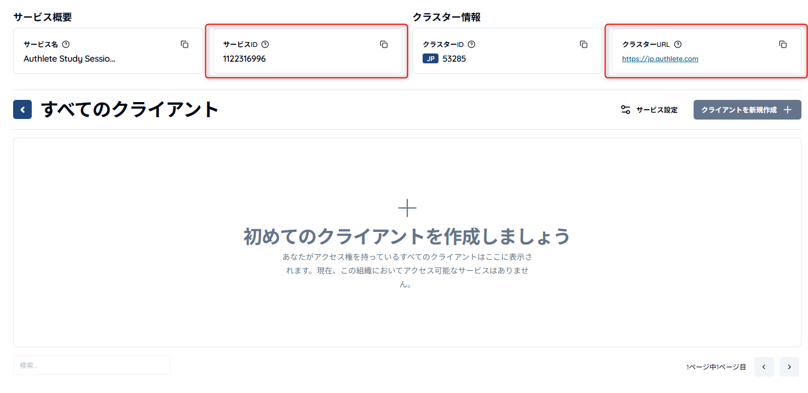
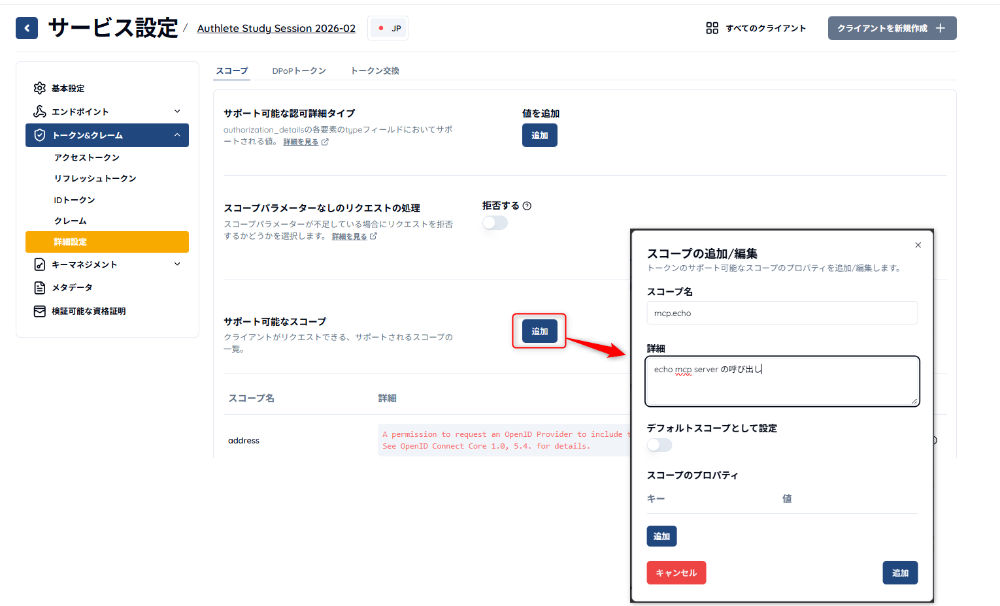
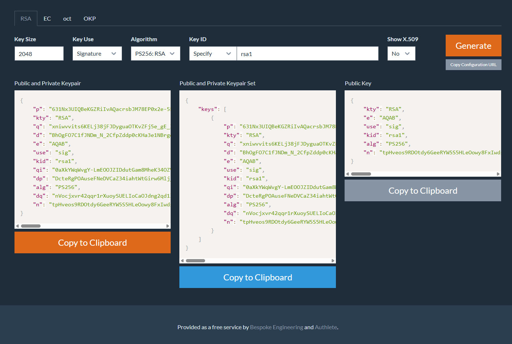
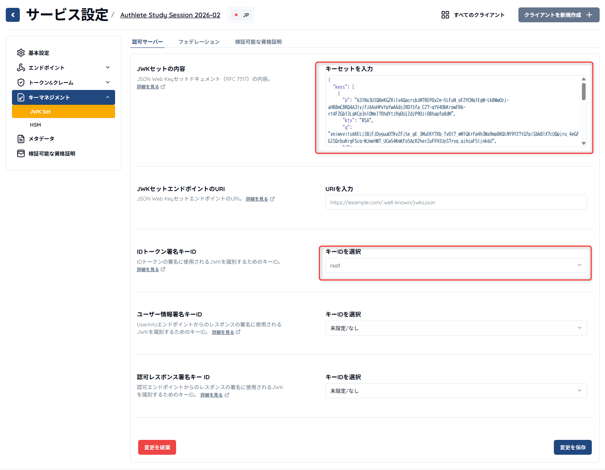
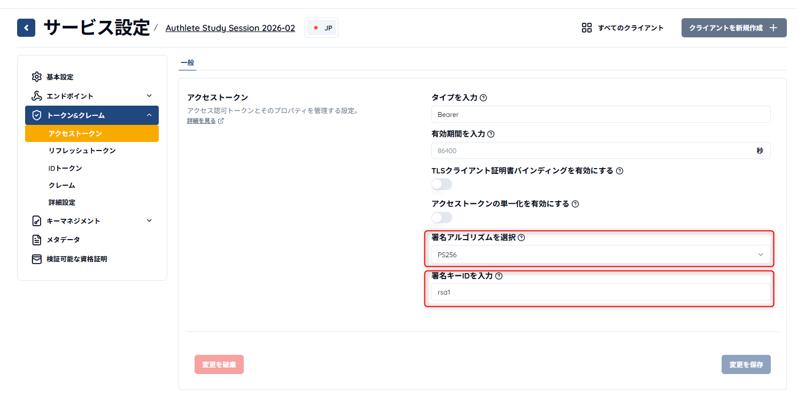
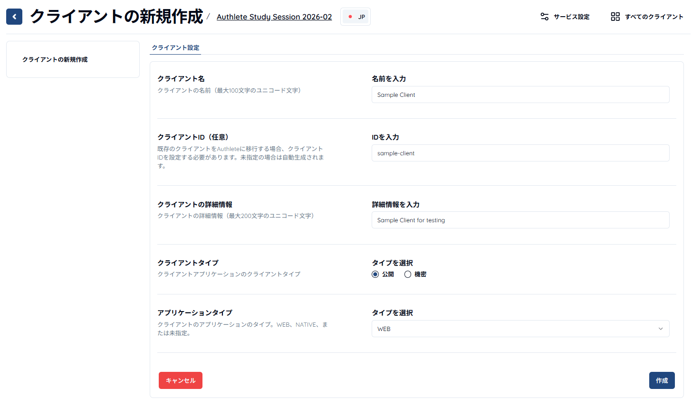
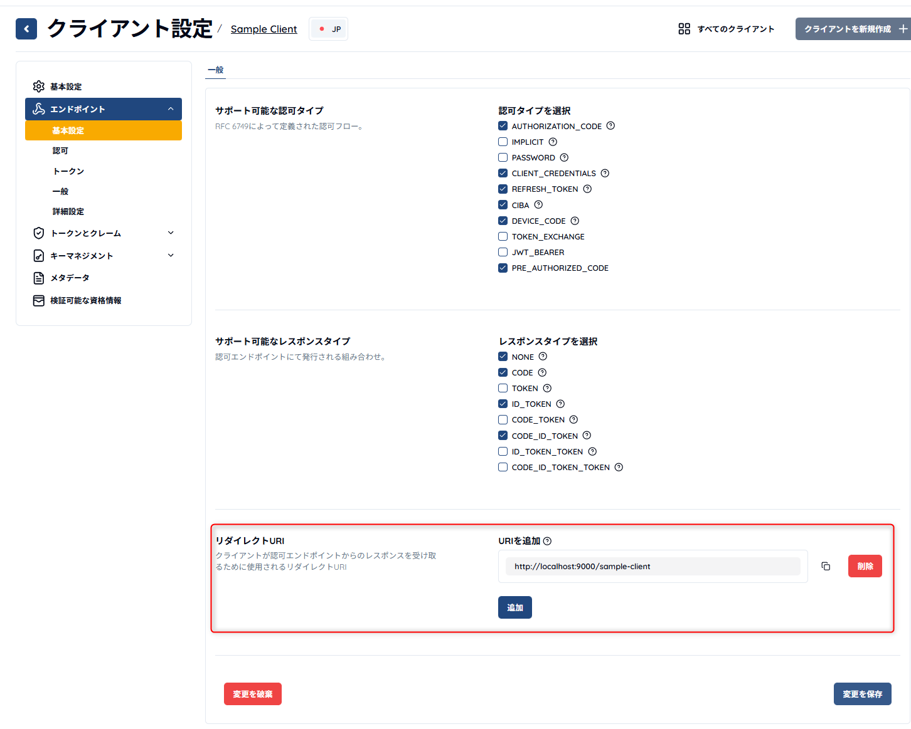

# Authlete Setup

Sign up for Authlete and create a service and a sample client. An Authlete service corresponds to an "authorization server" and its behavior is determined by changing the service settings.
In this hands-on session, configure the following to implement an authorization server that protects an MCP server.

1. Grant types: enable authorization code grant and refresh token grant
2. Require PKCE for authorization code exchange
3. Add an MCP-server scope (mcp.echo)
4. Register a JWKS set for JWT token signing
5. Enable CIMD (Client ID Metadata Document)

## Copy the .env File

Before you start, create the authorization server configuration file.

```sh
cp .env.example .env
```

Write the service ID and other values you obtain from the Authlete console into this file.

## Sign Up for Authlete

First, refer to the Authlete [Quick Start Guide](https://www.authlete.com/ja/developers/getting_started/) and complete the steps to sign up for a free trial account and create a service access token.
Save the access token in the `.env` file as `AUTHLETE_SERVICE_ACCESSTOKEN`.

From the created service's [All Clients] screen, save the `Service ID` and `Cluster URL` as `AUTHLETE_SERVICE_APIKEY` and `AUTHLETE_BASE_URL`, respectively.



Your `.env` file should look like this:

```env
# Authlete Settings
AUTHLETE_SERVICE_APIKEY=1122316996 # Replace with your Authlete service API key
AUTHLETE_BASE_URL=https://jp.authlete.com
AUTHLETE_SERVICE_ACCESSTOKEN=CCVfO91zGcjgUkatssaNwSsGG-NYTbFlbO8ORSEkFLQ # Replace with your Authlete service access token
```

## Configure the Authlete Service

### Grant Types

In [Endpoints] > [Basic Settings] > [General] > [Supported Grant Types], select only `AUTHORIZATION_CODE`, `REFRESH_TOKEN`, and `DEVICE_CODE`, then click Save Changes.

> Note: You won't implement `DEVICE_CODE` in this hands-on, but VS Code metadata specifies `urn:ietf:params:oauth:grant-type:device_code` in `grant_types`, so it must be enabled. You can override unsupported grant types with a [Client Metadata Policy](https://qiita.com/TakahikoKawasaki/items/e4898a31f3ae52be3eff), but at the time of this session there is no setting in the console, so we take the above approach.

### Require PKCE

In [Endpoints] > [Authorization] > [General] > [PKCE], enable `Require PKCE` and `Require S256 for Code Challenge Method`, then click Save Changes.

### Add the MCP Server Scope (mcp.echo)

1. In [Token & Claims] > [Advanced Settings] > [Scopes] > [Supported Scopes], click `Add`.
2. Set the scope name to `mcp.echo` and the description to `Call the echo MCP server`, then click `Add`.
3. Click Save Changes.



> Note: The scope configured here corresponds to `MCP_SCOPES` in `.env`. The sample MCP server uses this value for the `scope` in the `WWW-Authenticate` header returned with a 401 response and for `supported_scopes` in Protected Resource Metadata.

### JWK Set Content

Set the JWK (JSON Web Key) for signing access tokens and ID tokens. First, visit https://mkjwk.org and create an `RS256` key pair. Use the following parameters and click Generate.

- Key Size: 2048
- Key Use: Signature
- Algorithm: PS256
- Key ID: Specify
    - Key ID value: rsa1



Copy the Public and Private Keypair Set from the middle of the page and paste it into the Authlete service settings at [Key Management] > [JWK Set] > [Authorization Server] > [JWK Set Content]. Set the ID token signing key ID to `rsa1`.



Likewise, in [Token & Claims] > [Access Token] > [General], set `Select Signing Algorithm` to `PS256` and `Signing Key ID` to `rsa1`, then click Save Changes.



### Enable CIMD (Client ID Metadata Document)

In service settings, enable [Metadata] > [Client ID Metadata (CIMD)] > [Client ID Metadata Document (CIMD)]. Also enable [Always Fetch Metadata] and [Allow HTTP Scheme].

Authlete service configuration is now complete.

## Create a Sample Client

Register a sample client for verifying the authorization server behavior.

1. In the Authlete console service settings or in [All Clients], click the [Create New Client] button at the top right.
2. Register the client with the following parameters.
  1. Client name: Sample Client
  2. Client ID: sample-client
  3. Client description: Sample Client for testing
  4. Client type: Public
  5. Application type: Web



3. In the client settings under [Endpoints] > [Basic Settings] > [Redirect URIs], add `http://localhost:9000/sample-client`.



4. In the client settings under [Token & Claims] > [ID Token] > [ID Token Signing Algorithm], set `PS256` and click Save Changes.

Client setup is complete.

After you finish implementing the authorization server, you will configure endpoints again, but for now the console settings are complete.

## Next Step

[Implement the authorization server](./02-implement-authorization-server.md)
