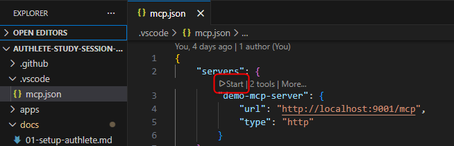
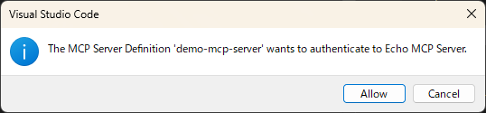
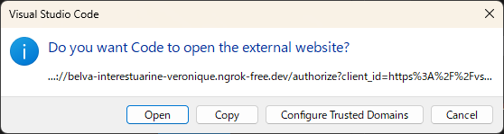
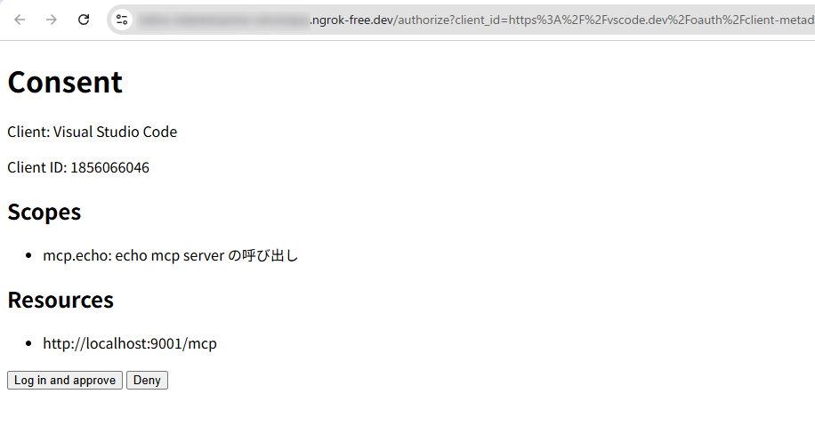
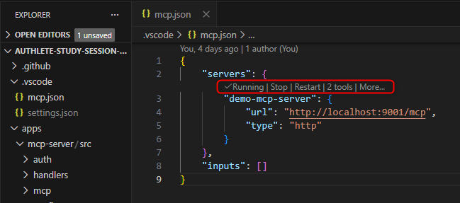
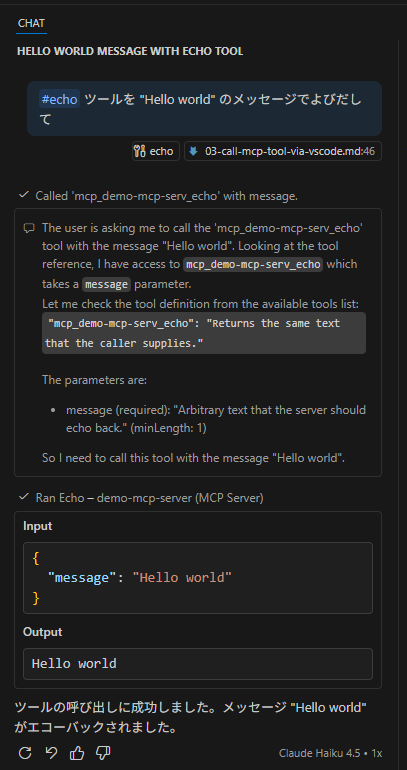
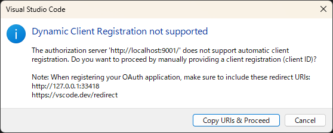
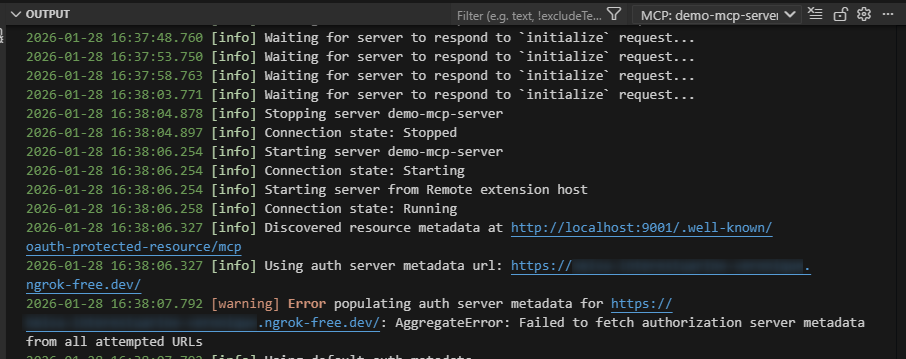
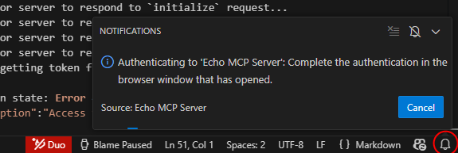

# Integration with Visual Studio Code

Visual Studio Code (VS Code) is an AI agent that has supported CIMD early on.
In this final chapter, you will connect to an MCP server protected by your own authorization server from VS Code and confirm that the agent can call tools.
If you have implemented everything up to this point, client registration via CIMD, token acquisition, and MCP server connection should all work.

## MCP Server Implementation

The MCP server is implemented using `@hono/mcp` in [/apps/mcp-server/src/index.ts](/apps/mcp-server/src/index.ts). Since `@hono/mcp` only generates Protected Resource Metadata, you must implement token verification and 401 Unauthorized responses yourself. That is done in [bearer-guard.ts](/apps/mcp-server/src/auth/bearer-guard.ts).

## Connecting to the MCP Server

There are several ways to connect to the MCP server, but here we use workspace settings ([/.vscode/mcp.json](/.vscode/mcp.json)).
It is already included in the sample repository, so open this repository in VS Code and open [/.vscode/mcp.json](/.vscode/mcp.json).

You should see a Start button above demo-mcp-server.

Click Start and a dialog will appear. Click Allow.

From the 401 Unauthorized response from the MCP server (WWW-Authenticate header) and the Protected Resource Metadata, VS Code will access the authorization server metadata. If your authorization server is implemented correctly, VS Code will attempt an authorization request using CIMD.

> Note: Confirm that client_id starts with https%3A%2F%2Fvscode...

Click Open in the dialog to have the browser send an authorization request to the authorization server. If your implementation is correct, some consent screen should appear.

In the sample implementation, the following screen is shown.

After you complete consent and return to VS Code, the UI changes to show the MCP server is running and that two tools are available.

## Calling from GitHub Copilot

From the VS Code command palette, run the `Chat: Open Chat` command.
In Chat, issue an instruction like the following specifying the MCP server to confirm it works.

> Call the #echo tool with the message "Hello world".

If it works, you should see output similar to the following.

## If You Cannot Connect

Here are common failure examples when the MCP server does not connect.

### Metadata is invalid

If the authorization server is not implemented correctly, you may see an error or a dialog asking for a client ID.

Connection logs for the MCP server are shown in the OUTPUT panel, so check there if you hit an error.

### Authorization flow started but did not finish

After repeated debugging, the authorization flow can get stuck in an incomplete state.
Click the alarm icon at the bottom-right of VS Code to cancel the ongoing authorization flow.

To delete caches such as client IDs, use the `removeDynamicAuthenticationProviders` command.
